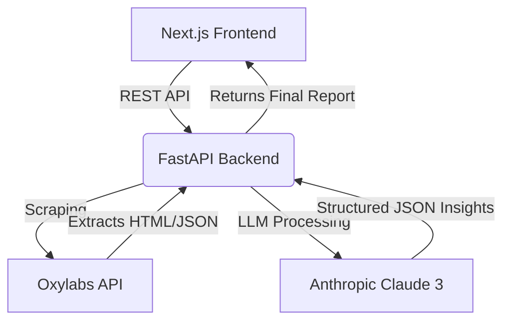

# Pixii Intelligence Dashboard ✦


Pixii Intelligence is a production-grade Amazon Market Intelligence platform. It automatically scrapes competitor data, analyzes customer reviews, estimates revenue from BSR, and generates a comprehensive 5-Act strategic intelligence report using AI.

## 🚀 Features

- **End-to-End Pipeline**: From a single Amazon search URL, the system scrapes competitor listings, images, and reviews.
- **AI-Powered Analysis**: Utilizes Anthropic's Claude 3 to perform deep sentiment analysis, extract top complaints, and generate actionable listing optimization briefs.
- **Revenue Estimation**: Algorithms to estimate competitor monthly revenue and unit sales based on Category BSR (Best Sellers Rank).
- **Listing Quality Score (LQS)**: Automated scoring of competitor listings based on asset presence (videos, rich descriptions, Q&A volume).
- **Magazine-Style UI/UX**: A highly polished, scroll-revealed, 5-Act dashboard built with Next.js, Tailwind CSS, and Recharts.

## 🏗 Architecture

The platform is split into a decoupled Frontend and Backend for scalability.



### Tech Stack
- **Frontend**: Next.js 14, React, Tailwind CSS, Recharts, Lucide Icons
- **Backend**: Python, FastAPI, Pydantic (Schema Validation)
- **Data Gathering**: Oxylabs E-Commerce API (formerly Apify/ScrapingBee)
- **AI Engine**: Anthropic Claude 3 (Opus/Sonnet) for JSON extraction and sentiment analysis

## 🛠 Setup Instructions

### 1. Backend (FastAPI)

```bash
cd backend
python -m venv venv
source venv/bin/activate  # On Windows: venv\Scripts\activate
pip install -r requirements.txt
```

Create a `.env` file in the `backend` directory (see `.env.example`):
```env
ANTHROPIC_API_KEY=your_claude_api_key
OXYLABS_USERNAME=your_oxylabs_username
OXYLABS_PASSWORD=your_oxylabs_password
```

Start the backend server:
```bash
uvicorn main:app --reload --port 8000
```

### 2. Frontend (Next.js)

```bash
cd frontend
npm install
```

Create a `.env.local` file in the `frontend` directory (see `.env.local.example`):
```env
NEXT_PUBLIC_API_URL=http://localhost:8000
```

Start the development server:
```bash
npm run dev
```

Visit `http://localhost:3000` to access the dashboard.

## 📸 Screenshots

*(Add screenshots of your 5 Acts here)*
- Act 1: Market Pulse & Revenue Distribution
- Act 2: Competition Map & Value Matrix
- Act 3: Customer Voice & Persona
- Act 4: Opportunity Gap & Revenue at Risk
- Act 5: Pixii Brief & Competitor Comparison

## 📦 Deployment

- **Frontend**: Deploys seamlessly to [Vercel](https://vercel.com). Make sure to set `NEXT_PUBLIC_API_URL` in your Vercel Environment Variables.
- **Backend**: Can be deployed to Render, Railway, or Heroku. Ensure you configure CORS in `main.py` with your deployed frontend URL.

## 📝 License
This project is created for demonstration and portfolio purposes.
